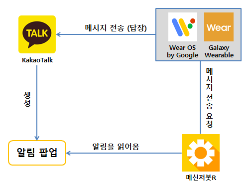
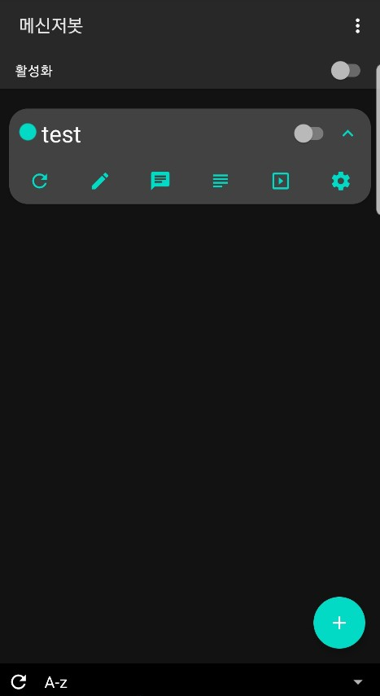
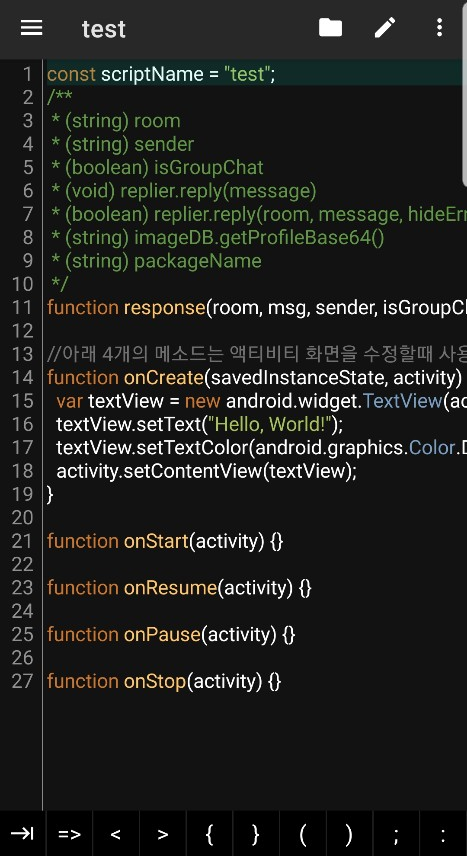
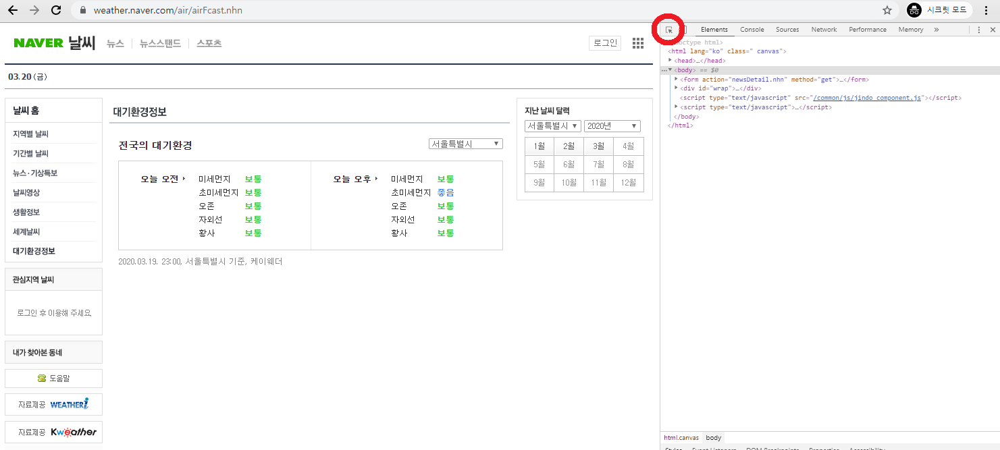
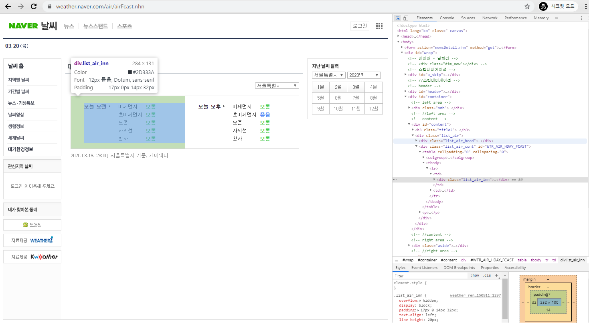

# 메신저 봇 개발

카카오톡에서 구동 가능한 자동응답 봇을 만들기 위한 개발 가이드입니다.

자동응답 어플 중 하나인 [메신저봇R](https://violet.develope.kr)을 사용하여 진행합니다.

 <br />

**목차**

* [환경구성](#환경구성)
  * [앱 플레이어 설치](#앱-플레이어-설치)
  * [필수 어플리케이션 설치](#필수-어플리케이션-설치)
* [메신저봇R](#메신저봇R)
  * [화면구성](#화면구성)
  * [개발](#개발)
  * [샘플 코드](#샘플-코드)
  * [테스트](#테스트)
* [기초 과정](#기초-과정)
  * [출력](#출력)
  * [변수](#변수)
  * [조건문](#조건문)
  * [반복문](#반복문)
  * [함수](#함수)
* [응용 과정](#응용-과정)
  * [포맷](#포맷)
  * [문자열 활용](#문자열-활용)
  * [랜덤 출력](#랜덤-출력)
  * [타이머](#타이머)
  * [날짜 및 시간](#날짜-및-시간)
  * [JSON](#JSON)
  * [파일 및 데이터베이스](#파일-및-데이터베이스)
  * [웹페이지 크롤링](#웹페이지-크롤링)
* [심화 과정](#심화-과정)
  * [공용 스크립트](#공용-스크립트)
  * [관리자 스크립트](#관리자-스크립트)
  * [카톡봇 스크립트](#카톡봇-스크립트)
* [참고](#참고)
 <br />

---

## 환경구성

### 앱 플레이어 설치
> 안드로이드 휴대폰일 경우, 앱 플레이어 설치 생략 가능합니다.

아이폰에서는 메신저봇R과 같은 자동응답 어플이 지원되지 않습니다. <br />
따라서, 휴대폰에서 사용할 수 없으므로 다음과 같이 PC에 개발환경 구성이 필요합니다.

1. PC 에서 모바일 애플리케이션을 구동하기 위한 앱플레이어를 하나 다운 받습니다.
   * [LD 앱플레이어](https://kr.ldplayer.net/)
   * [NOX 앱플레이어](https://kr.bignox.com/)

2. 앱 플레이어 내부에서 자동응답을 수행할 카카오톡 계정 로그인을 시도합니다.
   * 다른 기기에서 카카오톡 로그인 시, 단톡방이나 대화내용 등이 사라므로 다음과 같이 백업을 추천드립니다.
   ```
   # 기존 기기에서 수행
   1. 카카오톡 접속
   2. 더보기 > 설정 > 채팅 > 대화 백업
   3. 백업 패스워드 입력

   # 새로운 기기에서 수행
   1, 카카오톡 접속
   1. 복원하기
   2. 복원 패스워드 입력

   ※ 오래된 미디어 파일이나 비밀 채팅 및 오픈 채팅의 대화 내용은 백업이 되지 않습니다.
   ```   
   <br />

### 필수 어플리케이션 설치
> 자동 응답을 위해 필요한 앱은 총 3개 입니다.  <br />
> 구글 플레이스토어를 통해 앱을 설치해야하므로 구글 계정이 필요합니다.


|                   용도                   | 간단 설명                            |
| :------------------------------------: | :------------------------------- |
|                  카카오톡                  | 알림센터에 메시지를 표시합니다. (알림 팝업)        |
|                 메신저봇R                  | 알림센터에서 메시지를 읽어와 답장을 보낸다.         |
| Wear OS by Google <br> Galaxy Wearable | 자동 응답 어플로 부터 요청받은 답장을 실제로 전달합니다. |

1. 카카오톡
  ```
  카카오톡 알림이 꺼져 있거나 채팅방을 보고 있는 경우, 자동응답이 실행되지 않습니다.
  알림센터로 부터 메시지를 읽어와 답장을 보내야하기 때문에 알림 팝업 설정이 꼭 필요합니다.

  1. 카카오톡 접속
  2. 더보기 > 설정 > 알림
    * 메시지 알림 : ON
    * 알림 표시 > 알림 팝업 :  항상 받기
    * 알림 센터에 메시지 표시
        - 모든 채팅방 : 모든 채팅방에 자동 응답이 수행됨
        - 알림 켠 채팅방만 : 알림을 켠 채팅방만 자동 응답이 수행됨


  ※ 카카오톡 부계정을 생성하는 방법
    1. 다이소 국민 유심(5000원)을 구입합니다.
        - 유심 구입 시, 뒷면의 가입 가능한 요금제를 확인합니다.
        - LG U+ 이야기알뜰 요금제의 경우, 2년간 월 통신비 0원입니다.
    2. 설명서를 따라 공기계에 유심을 삽입한 후 새로운 휴대폰 번호를 개통합니다.
    3. 이후 와이파이만 연결해서 사용하면 월 통신비 0원!
        - 3개월간 통화내역이 없을 경우, 요금제가 자동 변경되므로 주의바랍니다.
  ```

2. 메신저봇R
  ```
  구글 플레이스토어에서 설치 가능한 다른 자동 응답 어플을 사용하셔도 되지만, 사용 언어나 API에 차이가 있을 수 있습니다.

  알림 팝업을 읽어올 권한이 필요합니다.
  첫 실행 시 권한 설정 화면이 출력되지만 설정하지 못한 경우, 다음과 같이 권한을 부여합니다.

  # 알림 읽기 권한
   1. 메신저봇R 접속
   2. 우측 상단 > 설정 > 공용 설정 > 기타 > 알림 읽기 권한
        - 메신저봇 활성화
  ```

3. Wear OS by Google 또는 Galaxy Wearable
  ```
  답장을 보내기 위해 사용되는 어플입니다. 둘 중 하나가 설치만 되어있으면 됩니다.
  스마트워치에서 답장을 보낼 때 사용하는 어플이기도 합니다.
  ```

<br />

---

## 메신저봇R 
메신저봇R 에서는 `JavaScript`를 사용합니다.

### 화면구성
 </img></img>  </img>

**메인화면**
> `추가` 버튼을 클릭하여 새로운 스크립트를 생성합니다.
- 활성화 : 모든 스크립트에 대하여 활성화/비활성화 여부를 지정합니다.
- 추가(+) : 새로운 스크립트를 추가합니다. (스크립트 ≒ 봇)

<br />

**메인화면 - test 스크립트**
> 스크립트에 대한 컴파일이 필요한 경우, 좌측에 초록색 아이콘이 표시됩니다.
- `활성화` : 해당 스크립트에 대하여 활성화/비활성화 여부를 지정합니다.
- `새로고침` : 스크립트를 컴파일합니다. (컴파일: 소스코드를 실행파일로 변환하는 작업)
- `연필모양` : 스크립트를 편집합니다.
- `채팅모양` : 스크립트가 잘 구동하는지 테스트합니다.
  * 디폴트 Room 이름 : `DEBUG ROOM`
  * 디폴트 Sender 이름 : `DEBUG SENDER`
- `막대모양` : 스크립트에서 출력되는 로그 메시지를 확인합니다.
- `재생버튼` : ???
- `설정버튼` : 스크립트에 대한 개별 설정입니다.

<br />

**편집화면 - test 스크립트**
> 코드 수정 후 반드시 우측 상단 폴더의 `저장하고 컴파일`을 수행해야 합니다.
- `폴더모양` : `저장` 또는 `저장하고 컴파일`
- `연필모양` : 되돌리기, 다시 실행, 모두 선택, 붙여넣기 등 편집 도구
- `설정버튼` : 자동 정렬, 검색, 공유, 이동, 자세히(문자 및 라인 수) 등 편의 도구
  * Beautify(Experimental) : 자동 정렬 (소스코드를 보기 편하게 탭 등을 자동으로 정렬)

<br />

### 개발

**기본 소스코드**
```javascript
const scriptName = "test";
function response(room, msg, sender, isGroupChat, replier, imageDB, packageName) {
// 이 주석을 제거한 뒤 중괄호 {} 안에 원하는 소스코드를 작성합니다.
}

//아래 4개의 메소드는 액티비티 화면을 수정할때 사용됩니다.
function onCreate(savedInstanceState, activity) {
var textView = new android.widget.TextView(activity);
textView.setText("Hello, World!");
textView.setTextColor(android.graphics.Color.DKGRAY);
activity.setContentView(textView);
}

function onStart(activity) {}

function onResume(activity) {}

function onPause(activity) {}

function onStop(activity) {}
```
<br />

**작성 예시**
> `function response`은 하나만 존재하며, 이 함수 내부에 앞으로 수행될 봇의 소스코드를 작성하게 됩니다. <br />

* 모든 명령문은 `세미콜론(;)`으로 끝나야합니다.
* 중괄호`{}`는 둘 이상의 명령문의 영역(범위)를 의미하며, `{`와 `}` 한 쌍이 세트입니다.
* `//` 로 시작하거나 `/* */`으로 감싸여진 부분은 **주석**으로 코드가 수행되지 않습니다.

```javascript
function response(room, msg, sender, isGroupChat, replier, imageDB, packageName) {
  // 알림 팝업이 올 때마다 "안녕!" 이라는 메시지 답장
  replier.reply("안녕!");
}
```

<br />

`function response`의 각 파라미터는 다음과 같습니다.
| 파라미터        | 설명                                                |
| ----------- | ------------------------------------------------- |
| room        | 채팅방의 이름입니다.                                       |
| sender      | 보낸이의 이름입니다.                                       |
| isGorupChat | 단체톡방 여부입니다. (`false`: 개인톡방, `true`: 단체톡방)         |
| replier     | 답장을 보내기 위한 객체입니다.                                 |
| imageDB     | 프로필 이미지와 관련된 객체입니다.                               |
| packageName | 알림 팝업을 띄운 어플의 패키지명입니다. (ex. `com.kakao.talk.apk`) |

<br />

### 샘플 코드
> 채팅방 이름(room)과 메시지(msg)를 확인하지 않을 경우, 모든 채팅방의 모든 메시지에 답장을 보내므로 주의바랍니다!

```javascript
function response(room, msg, sender, isGroupChat, replier, imageDB, packageName) {

  // 채팅방 이름이 "DEBUG ROOM" 이 아닐 경우, response 함수 종료
  if (room != "DEBUG ROOM") return;

  // 메시지가 "하이"일 경우, "Hi!" 답장
  if (msg == "하이") {
    replier.reply("Hi!");
  }

  // 메시지가 "안녕"일 경우, "ㅇㅇ"님, 안녕하세요!" 답장
  if (msg == "안녕") {
    replier.reply(sender + "님, 안녕하세요!");
  }

  // 메시지가 "여기 단체 톡방이야?"인 경우,
  if (msg == "여기 단체 톡방이야?" && isGroupChat) {
    if (isGroupChat) {
      replier.reply("네!"); // 단체 톡방인 경우, "네!" 답장
    } else {
      replier.reply("아니요!"); // 개인 톡방인 경우, "아니요!" 답장
    }
  }

  // 메시지가 "방장 소환"인 경우, 방장의 채팅방(ex. 관리방)에 메시지 보내기 (답장X)
  if (msg == "방장 소환") {
    replier.reply("관리방", "방장님! " + room + "에서 불러요!!"); // 관리자님! 테스트방에서 불러요!!
  }
  
}
```
 <br />

### 테스트

코드 작성이 끝났다면 `저장 후 컴파일`을 진행한 뒤, 메인 화면의 `채팅 모양`을 클릭해서 테스트합니다.

<br />

**만약, 디버그룸에서 답장이 오지 않는경우 다음을 확인합니다.**

1. 제대로 `저장 후 컴파일`이 되어 있는지 확인합니다.

   - 컴파일이 되어 있지 않은 경우, 메인화면 스크립트 좌측에 `초록색 동그라미`가 떠 있습니다.

2. 해당 스크립트와 전체 스크립트 활성화 버튼이 모두 켜져 있는지 확인합니다.

3. 메신저봇R 앱을 처음 구동할 때 권한을 설정하지 않았다면, `알림 읽기 권한`을 활성화 합니다.

   - 우측 상단 > 설정 > 공용 설정 > 기타 > 알림 읽기 권한 : 메신저봇 활성화

4. 그래도 되지 않을 경우, 휴대폰을 재부팅하면 높은 확률로 해결됩니다. (`최초 1번`)

<br />

**만약, 디버그룸에서는 답장이 오는데 카톡은 답장이 되지 않는다면 다음을 확인합니다**

1. 자신이 현재 답장을 보낼 채팅방을 보고 있는 지 확인합니다.

   - 자신이 읽고 있어서 알림 팝업이 뜨지 않을 경우, 답장을 보내지 않습니다.

2. 카카오톡의 `더보기 > 설정 > 알림` 이 켜져있는지 확인합니다.
   - 메시지 알림 : ON
   - 알림 표시 > 알림 팝업 : 항상 받기
   - 알림 센터에 메시지 표시
     - 모든 채팅방 : 모든 채팅방에 자동 응답이 수행됨
     - 알림 켠 채팅방만 : 알림을 켠 채팅방만 자동 응답이 수행됨

<br />

**오픈 채팅에서 실제 유저명와 `sender`가 일치하지 않을 경우, 원인은 다음과 같습니다**
  - `유저1`이 오픈 채팅방 입장 후 카드 프로필 `유저2`로 변경 시, `유저2`가 아닌 `유저1`로 인식합니다.
  - 위 경우, 해당 사용자가 오픈 채팅방 퇴장 후 카드 프로필로 입장하면 해결됩니다.

<br />

---

## 기초 과정
> 기본적인 프로그래밍에 대해서 이미 알고 있는 경우, [응용 과정](#응용-과정)부터 보시면 됩니다.

* 모든 명령문은 `세미콜론(;)`으로 끝나야합니다.
* 중괄호`{}`는 둘 이상의 명령문의 영역(범위)를 의미하며, `{`와 `}` 한 쌍이 세트입니다. (명령문이 하나일 경우, 생략 가능)
* `//` 로 시작하거나 `/* */`으로 감싸여진 부분은 **주석**으로 코드가 수행되지 않습니다.

### 출력
> 사람이 데이터를 실제 눈으로 확인할 수 있도록 데이터를 출력해봅시다.

| 소스코드                              | 출력 위치                         | 비고                                        |
| --------------------------------- | ----------------------------- | ----------------------------------------- |
| puts("`데이터`")                     | 웹 콘솔 화면(`F12`)                | 기본 출력함수. `https://jsfiddle.net/` 테스트 시 사용 |
| document.write("`데이터`")           | 웹 페이지 화면                      | 기본 출력함수. `https://jsfiddle.net/` 테스트 시 사용 |
| --------------------------------- | ----------------------------- | ----------------------------------------- |
| replier.reply("`데이터`")            | 카카오톡 등 메시지 답장                 | 답장. `메신저봇R`에서만 사용됩니다.                     |
| i("`데이터`"), info("`데이터`")         | `메신저봇R` 앱 로그 메시지              | 정보 로그. `메신저봇R`에서만 사용됩니다.                  |
| e("`데이터`"), error("`데이터`")        | `메신저봇R` 앱 로그 메시지              | 에러 로그. `메신저봇R`에서만 사용됩니다.                  |
| d("`데이터`"), debug("`데이터`")        | `메신저봇R` 앱 로그 메시지              | 디버그 로그. `메신저봇R`에서만 사용됩니다.                 |
| clear()                           | -                             | `메신저봇R` 앱 로그 메시지를 모두 지울 때 사용됩니다.          |

**bot.js**

```javascript
const scriptName = "bot.js";

function response(room, msg, sender, isGroupChat, replier, imageDB, packageName) {  
  replier.reply("메시지를 받은 톡방에 메시지를 보냅니다");
  replier.reply("테스트방", "테스트방에 메시지를 보냅니다");  

  debug("디버그 로그를 작성합니다");
  error("에러 로그를 작성합니다");
  info("정보 로그를 작성합니다");
  clear(); // 로그를 모두 지웁니다.
}
```

<br />

### 변수
> 특정 데이터를 저장해두기 위한 공간으로 프로그래밍 언어별로 여러가지 변수 타입이 존재합니다. <br />
> `Javascript`에서는 대부분의 변수를 선언할 때 `var`를 사용합니다.

- 숫자 : `1` , `2`, `3`, ...
  ```javascript
  var a = 3, b = 7;
  replier.reply(a + b);   // 결과 : 10
  ```
- 문자 : `'A'`, `'B'`, `'C'`, ...
  ```javascript
  var score = 'A';
  replier.reply(score + " 학점"); // 결과 : A 학점
  ```
- 문자열 : `"ABC"`, `"abc"`, ... 
  ```javascript
  //          0 1 2 
  var name = "홍길동";
  replier.reply(name);    // 결과 : 홍길동
  replier.reply(name[1]); // 결과 : 길
  ```
- 배열 : `new Array()`, `[]`, `[1,2,3]`, `['a','b',c']`, `["ab","bc"]`, ...
  - 배열은 여러 데이터를 연속하여 저장하기 위한 공간입니다.
  - 인덱스는 0 부터 시작하며, 인덱스를 통해 배열의 특정 값에 접근 할 수 있습니다..
  - _**※ 배열의 인덱스를 넘어간 경우, 오류가 발생하여 프로그램이 멈추므로 주의!!!**_
  ```javascript
  var array = ["봄","여름","가을","겨울"];

  replier.reply(array[0]); // 봄
  replier.reply(array[1]); // 여름
  replier.reply(array[2]); // 가을
  replier.reply(array[3]); // 겨울
  replier.reply(array[4]); // 세그먼트 오류 발생(배열 범위 초과)으로 인해 프로그램 강제 종료
  ```
- 객체 : `new Object()`, `{}`, `{name: "홍길동", age : 13}`, ... 
  - 객체는 `키:값`으로 데이터를 저장하기 위한 공간입니다.. 
  - `키`를 통해 `값`을 가져올 수 있으며, 아무것도 없을 경우 `undefined`가 반환됩니다.
  ```javascript
  var object1 = {1: "일", 2: "이"};
  replier.reply(object1[0]); // undefined 출력
  replier.reply(object1[1]); // 1와 대칭되는 "일" 출력
  replier.reply(object1[2]); // 2와 대칭되는 "이" 출력

  var object2 = {"일": "하나", "이": "둘"};
  replier.reply(object2["일"]); // "일"과 대칭되는 "하나" 출력
  replier.reply(object2["하나"]); // undefined 출력
  replier.reply(object2["이"]); // "이"와 대칭되는 "둘" 출력
  ```

<br />

### 조건문
> 조건에 따라 특정 명령문을 사용하기 위한 조건문에 대한 설명입니다.

<br />

**연산자**
> 변수 `A`와 `B`를 통한 연산자 요약입니다.

| 논리 연산자   | 의미  | 설명            |
| -------- | --- | ------------- |
| A        | -   | A가 참일 경우      |
| !A       | NOT | A 가 참이 아닐 경우  |
| A \|\| B | OR  | A 또는 B가 참일 경우 |
| A && B   | AND | A와 B 모두 참일 경우 |

| 비교 연산자 | 의미                       | 설명                |
| ------ | ------------------------ | ----------------- |
| A < B  | greater than             | A 보다 B가 클 경우      |
| A <= B | greater than or equal to | A 보다 B가 크거나 같을 경우 |
| A > B  | less than                | A 보다 B가 작을 경우     |
| A >=B  | less than or equal to    | A 보다 B가 작거나 같을 경우 |
| A == B | equals                   | A 와 B가 같을 경우      |
| A != B | not equal to             | A 와 B가 같지 않을 경우   |

<br />

**if문**
> if - else if - else 형태로 특정 조건을 만족할 경우에만, 명령어가 실행됩니다.

* `if` : 단독으로 사용 가능합니다.
* `else if` : `if`의 뒤에만 사용 가능합니다. (앞의 조건이 만족하지 않을 경우 조건 확인)
* `else` : `if` 또는 `else if`의 뒤에만 사용 가능합니다. (앞의 조건이 만족하지 않을 경우 명령어 수행)

```javascript
// a == 1 이 참일 경우, replier.reply("True"); 실행 
var a = 1;
if (a == 1) replier.reply("True");

// a == 1 이 참일 경우, replier.reply("True"); 실행
// 위 조건이 아닐 경우, replier.reply("False"); 실행
var a = 1;
if (a == 1) {
    replier.reply("True");
} else {
    replier.reply("False");
}

/* 점수에 따른 학점 출력 */
var a = 98;
if (a > 90) { // a 가 90 이상이면, A 출력 
    replier.reply("A");
} else if (a > 80) { // 위 모든 조건이 아니고 a 가 80 이상이면, B 출력
    replier.reply("B");
} else if (a > 70) { // 위 모든 조건이 아니고 a 가 70 이상이면, C 출력
    replier.reply("C");
} else if (a > 60) { // 위 모든 조건이 아니고 a 가 60 이상이면, D 출력
    replier.reply("D");
} else {             // 위 모든 조건이 아닐 경우, F 출력
    replier.reply("F");
}
```

**switch문**

> 특정 변수의 값과 동일한 `case`의 명령문 부터 시작합니다. `break`를 만날 경우, switch를 종료합니다. <br />
동일한 case가 없을 경우, `default`의 명령문 부터 시작합니다.

```javascript
// 숫자 비교 => "일"
var number = 1;
switch (number) {
    case 1: puts("일"); break;
    case 2: puts("이"); break;
    case 3: puts("삼"); break;
    case 4: puts("사"); break;
    default: puts("??"); break;
}

// 문자 비교 => "비"
var ch = 'B';
switch (ch) {
    case 'A': puts("에이"); break;
    case 'B': puts("비"); break;
    case 'C': puts("씨"); break;
    case 'D': puts("디"); break;
    default: puts("??"); break;
}

// 문자열 비교 => "에이"  (*문자열 비교는 javascript에서만 가능합니다.)
var str = "에이";
switch (str) {
    case "에이": puts("A"); break;
    case "비": puts("B"); break;
    case "씨": puts("C"); break;
    case "디": puts("D"); break;
    case "에프": puts("F"); break;
    default: puts("??"); break;
}

// 특정 월이 입력된 경우, 어떤 사계절인지 출력하기
// (break 또는 switch의 끝을 만날 떄까지 명령문을 이어서 수행합니다.)
var month = 3;
switch (month) {
    case 12:
    case 1:
    case 2:
        puts("겨울"); break;
    case 3:
    case 4:
    case 5:
        puts("봄"); break;
    case 6:
    case 7:
    case 8:
        puts("여름"); break;
    case 9:
    case 10:
    case 11:
        puts("가을"); break;
    default:
        puts("1~12월 사이를 입력해주세요.");
        break; // default 아래로는 switch가 종료되므로 break 생략 가능
}
```

<br />

### 반복문
> 반복문은 조건문을 만족할 때까지 반복하여 특정 명령문을 반복 수행합니다.

- `continue` : 반복문 내의 명령문일 경우, 반복문 { }을 `증감문 - 조건문`으로 건너뜁니다.
- `break` : 반복문 내의 명령문일 경우, 반복문 { }을 종료합니다.

**for문** 
> for (초기문; 조건문; 증감문) { } 형태로, 조건을 만족하면 { } 를 반복 <br />
> `초기문 - 조건문 - 명령문{} - 증감문 - 조건문 - 명령문{} - 증감문 - ...` 반복
```javascript
// 0 부터 4 까지의 합
var sum = 0;
for (var i = 0; i < 5; i++) {
	sum += i;
}

// 0 부터 4 까지의 합
var i = 0, sum = 0;    // 반복문
for (;;) {
    if (i > 4) break;  // 조건문
    sum += i;          // 명령문
    i++;               // 증감문
}

// 배열의 "여름" 데이터의 idx 반환
var array = ["봄", "여름", "가을", "겨울"];
for (var idx in array) {
    if (array[idx] == "여름") puts(idx); // 1 반환 
}
```

**while문**
> while (조건문) { } 형태로, 조건을 만족하면 { } 를 반복 
```javascript
var i = 0;
while (i < 5) {
	명령문;
	i++;
}
```

**do-while문**
> do{ } while (조건문); 형태로, { } 를 한 번 수행 후 조건을 만족하면 { } 를 반복 
```javascript
var i = 0;
do{
	명령문;
	i++;
} while(i <= 5);
```

<br />

### 함수
> 유지보수와 가독성, 코드 재활용을 위해 특정 기능을 수행하는 함수를 작성하여 사용할 수 있습니다. 

**bot.js**
```javascript
const scriptName = "bot.js";

// 사용자 지정 함수
function add(a, b) {
  return a + b;
}

function sub(a,b) {
  return a - b;
}

// 메인 함수 
function response(room, msg, sender, isGroupChat, replier, imageDB, packageName) {
  replier.reply("1 + 3 = " + add(1,3)); //  4
  replier.reply("3 + 5 = " + add(3,5)); //  8
  replier.reply("4 - 9 = " + sub(4,9)); // -5 
}
```
> 

<br />

---

## 응용 과정
> `Javascript`와 `메신저봇`의 생소한 기능 등을 잘 알고 계신 경우, [심화 과정](#심화-과정)부터 보시면 됩니다.

- `메신저봇`에 대한 자세한 사항은 [메신저봇 구 API](https://deviolet.tistory.com/entry/%EB%A9%94%EC%8B%A0%EC%A0%80%EB%B4%87-%EA%B0%80%EC%9D%B4%EB%93%9C)를 참고합니다.

<br />

### 포맷
> 소스코드를 보기 편하게 `String` 문자열의 포맷을 지정하여 사용하기 위한 소스입니다.

**bot.js**

```javascript
const scriptName = "bot.js";

String.prototype.format = function () {
  var string = this;
  for (var i = 0; i < arguments.length; i++) {
    string = string.replace(new RegExp("\\{" + i + "\\}", "gm"), arguments[i]);
  }
  return string;
};

function response(room, msg, sender, isGroupChat, replier, imageDB, packageName) {
  var welcome = "{0}님, {1}에 오신 것을 환영합니다!".format(sender, room);
  replier.reply(welcome);
}
```

<br />

### 문자열 활용
> 문자열을 조작하기 위한 함수를 활용하여 봇을 개발합니다.

| 소스코드                             | 결과        | 기능                                  |
| -------------------------------- | --------- | ----------------------------------- |
| "`   테  스  트   `".trim()         | `테  스  트` | 문자열의 좌우 공백 제거                       |
| "`abcabca`".indexOf("`ca`")      | `2`       | `ca`의 첫번째 위치를 반환 (없으면, `-1` 반환)     |
| "`abcabca`".lastIndexOf("`ca`")  | `5`       | `ca`의 뒤에서 첫번째 위치를 반환 (없으면, `-1` 반환) |
| "`1 2 3 4`".split("` `")         | `1,2,3,4` | ` `을 기준으로 문자열 잘라서 배열로 반환            |
| "`abcabca`".substring(`0`,`3`)   | `abc`     | 문자열의 `0`번째 부터 `3`번째 전까지 잘라서 반환      |
| "`abcabca`".replace("`a`","`A`") | `Abcabca` | 처음 발견된 `a`를 `A`로 치환하여 반환            |
| "`abc`".concat("def")            | `abcdef`  |

```javascript
/* ----  trim  ---- */
replier.reply("     테스트용 메시지    ".trim());               // "테스트용 메시지" 반환 

/* ---- indexOf ---- */
//             012345
replier.reply("abcabc".indexOf("a")); // 0 반환
replier.reply("abcabc".indexOf("c")); // 2 반환
replier.reply("abcabc".indexOf("f")); // -1 반환

/* -- lastIndexOf -- */
//             012345
replier.reply("abcabc".lastIndexOf("a")); // 3 반환
replier.reply("abcabc".lastIndexOf("c")); // 5 반환
replier.reply("abcabc".lastIndexOf("f")); // -1 반환

/* ----  split  ---- */
var msg1 = "1 2 3 4";
replier.reply(msg1.split(" "));            // "1,2,3,4" 반환
replier.reply(msg1.split(" ")[0]);         // "1" 반환
replier.reply(msg1.split(" ")[3]);         // "4" 반환

var msg2 = "가나 다라 마바 사아 자차 카타 파하";
replier.reply(msg2.split(" "));            // "가나,다라,마바,사아,자차,카타,파하" 반환 
replier.reply(msg2.split(" ")[0]);         // "가나" 반환
replier.reply(msg2.split(" ")[3]);         // "사아" 반환

/* ---- substring ---- */
//         012345
var msg = "abcabc";
puts(msg.substring(1,3));        // "bc"
puts(msg.substring(3,6));        // "abc"

/* ---- replace ---- */
var msg = "abcabc"
puts(msg.replace("a","A"));      // "Abcabc" 반환 (처음 발견된 문자열1만 변경)
puts(msg.replace(/bc/g,"BC"));   // "aBCaBC" 반환 (모든 문자열1이 변경)
	// # 정규표현식 설명
  // - /bc : 문자열 bc 를 대상으로 
	// - /g : 모든 문자열을 치환한다.
	// - /i : 대소문자 구분없이 치환한다.
```

**bot.js**

```javascript
const scriptName = "bot.js";

function response(room, msg, sender, isGroupChat, replier, imageDB, packageName) {
  if (room != "DEBUG ROOM") return;

  // 메시지가 "안녕"으로 시작할 경우, "안녕1" 응답
  if (msg.indexOf("안녕") == 0) {
    replier.reply("안녕1");
  }

  // 메시지에 "안녕"이 포함된 경우, "안녕2" 응답
  if (msg.indexOf("안녕") != -1) {
    replier.reply("안녕2");
  }

  // 메시지에 "봇짱"이 포함된 경우, sender의 이름 + "님" 으로 변경하여 똑같이 응답
  if (msg.indexOf("봇짱") != -1) {
    replier.reply(msg.replace("봇짱", sender + "님"));
    // 아리 : 봇짱! 안녕?
    // 봇짱 : 아리님! 안녕?
  }
}
```

<br />

### 랜덤 출력
> 랜덤 함수를 이용하여 불특정한 데이터를 출력합니다.

- Math.ceil(Math.random() * (`최대값` - `최소값` + 1)) + `최소값` - 1

**bot.js**

```javascript
const scriptName = "bot.js";

function response(room, msg, sender, isGroupChat, replier, imageDB, packageName) {
  if (room != "DEBUG ROOM") return;

  // 안녕이 포함된 경우, 랜덤 인사 
  if (msg.indexOf("안녕") != -1) {
    var ment = ["안녕하세요!", "하이하이!", sender + "님, 안녕!"];  
    replier.reply(ment[Math.ceil(Math.random() * ment.length) - 1]);
  }

  // 주사위가 포함된 경우, 주사위 굴리기
  if (msg.indexOf("주사위") != -1) {
    var dice = Math.ceil(Math.random() * 6); // 1 ~ 6 랜덤 숫자
    switch (dice) {
      case 1: replier.reply("\u2680"); break; // ⚀
      case 2: replier.reply("\u2681"); break; // ⚁
      case 3: replier.reply("\u2682"); break; // ⚂
      case 4: replier.reply("\u2683"); break; // ⚃
      case 5: replier.reply("\u2684"); break; // ⚄
      case 6: replier.reply("\u2685"); break; // ⚅
    }
  }

  // *골라줘로 시작하는 경우
  if (msg.indexOf("*골라줘") == 0) {
    var content = msg.replace("*골라줘", "").trim(); // 좌우 공백 제거
    if (content == "") return; // 내용이 없을 경우, 종료

    var array = content.split(" "); // 띄어쓰기를 기준으로 나눠 배열 array 생성
    for (var idx in array) {
      if (array[idx] == "") array.splice(idx, 1); // 값이 없을 경우, 배열에서 제거
    }
    replier.reply(array[Math.ceil(Math.random() * array.length) - 1] + "!!");
  }
}
```
<br />

### 타이머
> `java.lang.Thread.sleep()`함수는 특정 시간 만큼 프로그램 수행을 일시정지합니다.

```javascript
var msg = "10";
var time = Number(msg.replace(/[^0-9]/g, ""));
if (time == "") return; // 숫자가 없을 경우, 종료

replier.reply("타이머 시작!\n" + time + "초 뒤에 타이머가 종료됩니다!");
java.lang.Thread.sleep(time * 1000); // 대기. 1000 = 1초
replier.reply(time + "초가 경과했습니다.");
```

<br />

### 날짜 및 시간 
> 날짜 및 시간과 관련된 기능에 대한 예제입니다.

- `get`이 아닌 `set`을 사용하면 변수에 저장된 시간을 변경 가능합니다.

```javascript
var date = new Date(); 
var yy = date.getFullYear();  // 년
var mo = date.getMonth() + 1; // 월 (0 ~ 11 => 0은 1월)
var dd = date.getDate();      // 일 
var weeks = ["일", "월", "화", "수", "목", "금", "토"];
var week = date.getDay();     // 요일 (0: 일요일, 1: 월요일, 2: 화요일, ... : 6: 토요일)
var hh = date.getHours();     // 시
var mm = date.getMinutes();   // 분
var ss = date.getSeconds();   // 초
```

```javascript
const scriptName = "bot.js";

// 윤년 계산 없이 대략적인 날짜 비교
function getLifeTime(year, month, day) {
  var diff = (new Date() - new Date(year, month, day, 0, 0, 0, 0)) /1000;

  var rtn_msg = "";
  rtn_msg = rtn_msg.concat(parseInt(diff / (60 * 60 * 24 * 365)) + "년 ");
  rtn_msg = rtn_msg.concat(parseInt((diff % (60 * 60 * 24 * 365)) / (60 * 60 * 24 * 30)) + "월 ");
  rtn_msg = rtn_msg.concat(parseInt((diff % (60 * 60 * 24 * 30)) / (60 * 60 * 24)) + "일 ");
  rtn_msg = rtn_msg.concat(Math.floor((diff % (60 * 60 * 24)) / (60 * 60)) + "시 ");
  rtn_msg = rtn_msg.concat(Math.floor((diff % (60 * 60)) / 60) + "분 ");
  rtn_msg = rtn_msg.concat(Math.floor((diff % 60) / 1) + "초");
  return rtn_msg;
}

function response(room, msg, sender, isGroupChat, replier, imageDB, packageName) {  
  // msg = "1997 01 19"
  var year = Number(msg.split(" ")[0].replace(/[^0-9]/g, ""));
  var month = Number(msg.split(" ")[1].replace(/[^0-9]/g, ""));
  var day = Number(msg.split(" ")[2].replace(/[^0-9]/g, ""));
  if (year == "" || month == "" || day == "") return; // 정보가 없을 경우 오류가 발생하므로 종료
  replier.reply(getLifeTime(year, month - 1, day);
}
```

<br />

### JSON
> `객체`와 `배열`을 묶어놓은 데이터 집합입니다.

* `JSON.parse()` : String 객체를 json 객체로 변환시켜줍니다.
* `JSON.stringify()` :json 객체를 String 객체로 변환시켜 줍니다.

```javascript
// create JSON 
var data = {
    "name": "bot",
    "age": 3,
    "isBot": true,
    "language": ["English", "Korean"],
    "command": {
            "hi": ["hi", "안녕"],
            "help": ["help", "도움말"]
    }
}

var text = JSON.stringify(data); // JSON -> String 
var json = JSON.parse(text);     // String -> JSON
```

<br />

### 파일 및 데이터베이스
> `메신저봇R`에서 제공하는 API를 통해 휴대폰에 파일을 생성하여 데이터를 읽기/쓰기/추가/삭제를 할 수 있습니다.

**안드로이드 기본 경로 참고**

- apk 기본 경로 : `/data/app/[package name]-[hashcode]/`
- 내부저장소 경로 : `/data/user/[User number]/[package name]/`
- 외부저장소 경로 : `/storage/emulated/0/Android/data/[package name]/`
- 공용저장소 경로 : `/storage/emulated/0/[Content 종류]`

**bot.js (기본 사용)**

```javascript
const scriptName = "bot.js";

var text = String();

function response(room, msg, sender, isGroupChat, replier, imageDB, packageName) {
  text = "FileStream은 입력받은 path 경로를 그대로 사용합니다.\n";

  // path경로(파일 이름까지 포함)에 data를 덮어씁니다. 반환값은 최종 파일 내용입니다.
  text = FileStream.write("/data/test/file1.txt", text);

  // path경로(파일 이름까지 포함)에 data를 이어씁니다. 반환값은 최종 파일 내용입니다.
  text = FileStream.append("/data/test/file1.txt", text);

  // path경로(파일 이름까지 포함)에 있는 파일 내용을 읽어 반환합니다.
  text = FileStream.read("/data/test/file1.txt");

  /* path경로(파일 이름까지 포함)을 삭제합니다.
   * 반환값은 java.io.File.delete()의 결과값, 또는 삭제중 예외가 발생할 경우 false를 반환합니다. */
  var result = FileStream.remove("/data/test/file1.txt");

  //////////////////////////////////////////////////////////////////////////
  text = "DataBase는 앱_데이터_폴더/Database/fileName을 사용합니다. (확장자가 없으면 .txt 사용)\n";

  // 앱_데이터_폴더/Database 폴더 내에 fileName이라는 파일을 만들고, data 문자열을 덮어씁니다. 최종 파일 내용을 반환합니다.
  text = DataBase.setDataBase("file2", text);

  // 앱_데이터_폴더/Database/fileName파일에 data를 이어씁니다. 최종 파일 내용을 반환합니다.
  text = DataBase.appendDataBase("file2", text);

  // 앱_데이터_폴더/Database/fileName 파일을 읽어 내용을 문자열로 반환합니다.
  text = DataBase.getDataBase("file2");

  /* 앱_데이터_폴더/Database/fileName 파일을 삭제합니다. java.io.File.delete()의 결과를 반환합니다.
   * 앱 옵션에서 삭제시 백업기능을 켜두었을 경우, fileName.bak으로 내용이 백업됩니다.  */
  var result = DataBase.removeDataBase("file2");
}
```

<br />

### 웹페이지 크롤링
> `JSOUP`을 사용한 `웹 크롤링`을 통해 특정 웹페이지의 정보를 가져올 수 있습니다.

<br />

**가져올 데이터 구조 확인 팁** 

크롬 브라우저에서 `F12`를 클릭해 개발자 도구를 연 뒤 좌측 상단의 버튼을 클릭합니다. <br />
커서를 사용하여 가져오길 원하는 부분을 클릭하면 해당 데이터의 HTML 소스코드를 우측에서 확인할 수 있습니다. 




<br />

**JSOUP 함수 요약** 
| 구분   | 가져올 HTML 소스코드                                    | 예시                                                              |
| ---- | ------------------------------------------------ | --------------------------------------------------------------- |
| 전체   | HTML 소스 전체                                       | var doc = org.jsoup.Jsoup.connect("https://github.com/").get(); |
| 클래스  | \<div class="test_class"\> 의 값                   | var element = doc.select(".test_class");                        |
| 아이디  | \<p id="test_id" alt="100"\> 의 값                 | var element = doc.select("#test_id");                           |
| 속성값  | \<p id="test_id" alt="100"\> 의 값                 | var element = doc.select("#test_id").attr("alt");               |
| 하위태그 | \<div class="test"\>\<a\>...\<\/a\>\<\/div\> 의 값 | var element = doc.select("div.test a");                         |
| 하위태그 | <ul\>\<li\>...\<\/li\>\<\/ul\> 의 값               | var element = doc.select("ul>li");                              |  |  |

<br />

**날씨 정보 가져오기**

- 다음과 같은 형태로 날씨 데이터 가져오기 
  ```
  서울특별시 날씨 ⛅
  (목요일) 오후 8:00

  구름 조금 19℃
  강수확률 : 1%
  습도 : 74%
  풍속 : 2m/s

  =-=-=-=-=-=-=-=-=-=-=-=-=
  목 : 흐림 (23 ~ 14℃)
  금 : 구름 조금 (26 ~ 16℃)
  토 : 흐림 (23 ~ 15℃)
  일 : 흐림 (23 ~ 14℃)
  월 : 구름 조금 (26 ~ 12℃)
  화 : 구름 조금 (24 ~ 10℃)
  수 : 구름 조금 (25 ~ 12℃)
  목 : 대체로 흐림 (26 ~ 12℃)
  ```

**bot.js**
```javascript
const scriptName = "bot.js";

function getWeather(replier, msg) {
  // 특정 웹 페이지로부터 HTML의 특정 소스코드(id = wob_wc) 가져오기
  var weather = org.jsoup.Jsoup.connect("https://www.google.com/search?q=" + msg.replace(" ", "+")).get().select("#wob_wc");;

  // 가져온 데이터가 없거나 공백일 경우 종료
  if (weather == undefined || weather == "") return ;

  // 날씨 데이터 파싱 
  var data = weather.select("#wob_loc").text() + " 날씨 ⛅";
  data = data.concat("\n" + weather.select("#wob_dts").text() + "\n");
  data = data.concat("\n" + weather.select("#wob_dc").text() + " ");
  data = data.concat("\n" + weather.select("#wob_tm").text() + "℃");

  var wob_d = weather.select("#wob_d").select(".wob-dtl");
  data = data.concat("\n강수확률 : " + wob_d.select("#wob_pp").text());
  data = data.concat("\n습도 : " + wob_d.select("#wob_hm").text());
  data = data.concat("\n풍속 : " + wob_d.select("#wob_ws").text());
  data = data.concat("\n\n=-=-=-=-=-=-=-=-=-=-=-=-=");

  var wob_df = weather.select(".wob_df");
  for (var i = 0; i < wob_df.size(); i++) {
    var t = wob_df.get(i);
    data = data.concat("\n");
    data = data.concat(t.select("div>div").get(0).text() + " : ");
    data = data.concat(t.select("div>img").attr("alt") + " ");
    data = data.concat("(" + t.select("div>div>span").get(0).text());
    data = data.concat(" ~ " + t.select("div>div>span").get(2).text() + "℃)");
  }
  replier.reply(data);
}

function response(room, msg, sender, isGroupChat, replier, imageDB, packageName) {  
  if (msg.indexOf("날씨") != -1) getWeather(replier,msg);
}
```

<br />

---

## 심화 과정
> 여러 기능을 활용하여 실제 봇을 작성해봅시다.

<br />

### 공용 스크립트

> 다른 스크립트에서 사용 가능한 공통 소스를 모아둔 `common.js`를 구현해봅시다. <br />
> `bot1.js`, `bot2.js`, ... 등 여러 개의 봇을 구동할 경우 유용하게 사용 가능합니다.

**common.js**

```javascript
const scriptName = "common.js";

function add(a, b) {
  return a + b;
}

function sub(a, b) {
  return a - b;
}
```

**bot.js**

```javascript
const scriptName = "bot.js";

var Common = Bridge.getScopeOf("common.js");

function response(room, msg, sender, isGroupChat, replier, imageDB, packageName) {
  var result1 = Common.add(3, 5);
  var result2 = Common.sub(3, 5);

  replier.reply("합 : " + result1 + ", 차: " + result2);
}
```

<br />

### 관리자 스크립트
> 스크립트를 제어 및 관리를 위한 관리자용 봇 스크립트를 작성합니다.

**admin.js**

- 관리자 정보는 `AdminList.json` 파일에 `프로필 이름`으로 관리합니다.
- `프로필 이미지`로 관리하고 싶은 경우, 프로필 이미지를 Base64의 형태로 반환하는 `imageDB.getProfileImage()`를 사용합니다.

```javascript
const scriptName = "admin.js";

var DFLT_ADMIN = [{ name: "관리자1" }, { name: "관리자2" }];

function getAdminList() {
  var database = DataBase.getDataBase("AdminList.json");
  if (database == null) {
    database = DataBase.setDataBase("AdminList.json", JSON.stringify(DFLT_ADMIN));
  }
  return database;
}

// 관리자 조회
function getAdminText() {
  var AdminList = JSON.parse(getAdminList());
  var text = "";
  for (var idx in AdminList) {
    text = text.concat(AdminList[idx]["name"] + "\n");
  }
  return text.slice(0, -1);
}

// 관리자 추가
function addAdmin(name) {
  var AdminList = JSON.parse(getAdminList());
  for (var idx in AdminList) {
    if (AdminList[idx]["name"] == name) return -1; // already exist
  }
  AdminList.push({ name: name });
  DataBase.setDataBase("AdminList.json", JSON.stringify(AdminList));
  return 0; // success
}

// 관리자 제거
function delAdmin(name) {
  var AdminList = JSON.parse(getAdminList());
  for (var idx in AdminList) {
    if (AdminList[idx]["name"] == name) {
      AdminList.splice(idx, 1);
      DataBase.setDataBase("AdminList.json", JSON.stringify(AdminList));
      return 0; // success
    }
  }
  return -1; // not exist
}

// 관리자 확인
function isAdmin(name) {
  var AdminList = JSON.parse(getAdminList());
  for (var idx in AdminList) {
    if (AdminList[idx]["name"] == name) return 1; // is admin
  }
  return 0; // isn't admmin
}

function help() {
  var help_msg = "[관리자 도움말]";
  help_msg = help_msg.concat("\n*도움말");
  help_msg = help_msg.concat("\n*공지 room 하고싶은말");
  help_msg = help_msg.concat("\n*봇 상태");
  help_msg = help_msg.concat("\n*디바이스 상태");
  help_msg = help_msg.concat("\n");
  help_msg = help_msg.concat("\n*재컴파일");
  help_msg = help_msg.concat("\n*구동 bot1 ...");
  help_msg = help_msg.concat("\n*중지 bot2 ...");
  help_msg = help_msg.concat("\n");
  help_msg = help_msg.concat("\n*관리자 조회");
  help_msg = help_msg.concat("\n*관리자 추가 admin1 ...");
  help_msg = help_msg.concat("\n*관리자 제거 admin1 ...");
  return help_msg;
}

function botStatus() {
  var stat_msg = "";
  var scripts = Api.getScriptNames();
  for (var idx in scripts) {
    stat_msg = "[" + scripts[idx] + " 봇 상태]";
    stat_msg = stat_msg.concat("\n 전원 상태 : " + Api.isOn(scripts[idx]));
    stat_msg = stat_msg.concat("\n 컴파일 완료 : " + Api.isCompiled(scripts[idx]));
    stat_msg = stat_msg.concat("\n 컴파일 진행중 : " + Api.isCompiling(scripts[idx]));
    stat_msg = stat_msg.concat("\n\n");
  }
  return stat_msg.slice(0, -2);
}

function deviceStatus() {
  var stat_msg = "[디바이스 상태]";
  stat_msg = stat_msg.concat("\n안드로이드 OS빌드 : " + Device.getBuild());
  stat_msg = stat_msg.concat("\n안드로이드 버전코드 : " + Device.getAndroidVersionCode());
  stat_msg = stat_msg.concat("\n안드로이드 버전이름 : " + Device.getAndroidVersionCode());
  stat_msg = stat_msg.concat("\n휴대폰 브랜드명 : " + Device.getPhoneBrand());
  stat_msg = stat_msg.concat("\n휴대폰 모델명 : " + Device.getPhoneModel());
  stat_msg = stat_msg.concat("\n");
  stat_msg = stat_msg.concat("\n충전 여부 : " + Device.isCharging());
  stat_msg = stat_msg.concat("\n충전기 타입 : " + Device.getPlugType());
  stat_msg = stat_msg.concat("\n배터리 잔량 : " + Device.getBatteryLevel() + "%");
  stat_msg = stat_msg.concat("\n배터리 온도 : " + Device.getBatteryTemperature());
  stat_msg = stat_msg.concat("\n배터리 전압 : " + Device.getBatteryVoltage() + "mV");
  stat_msg = stat_msg.concat("\n배터리 상태 : " + Device.getBatteryStatus());
  stat_msg = stat_msg.concat("\n배터리 건강상태 : " + Device.getBatteryHealth());
  return stat_msg;
}

function response(room, msg, sender, isGroupChat, replier, imageDB, packageName) {
  if (!isAdmin(sender)) return; // sedner가 관리자가 아닐 경우, 종료

  if (msg == "*도움말") replier.reply(help());

  if (msg == "*봇 상태") replier.reply(botStatus());

  if (msg == "*디바이스 상태") replier.reply(deviceStatus());

  if (msg.indexOf("*공지") == 0) {
    var contents = msg.replace("*공지 ", "").trim();
    if (contents == "") {
      replier.reply("ex) *공지 디버그룸 테스트 입니다.");
    } else {
      var room_name = contents.split(" ")[0]; // 공백이 오기 전 문자열
      var notice = contents.substring(contents.indexOf(" ") + 1); // 공백 다음 문자열
      replier.reply(room_name, notice);
    }
  }

  // 스크립트 재컴파일
  if (msg.indexOf("*재컴파일") == 0) {
    var contents = msg.replace("*재컴파일").trim();
    if (contents == "") {
      Api.reload();
      replier.reply("전체 스크립트가 재컴파일되었습니다.");
    } else {
      var scripts = contents.split(" ");
      for (var idx in scripts) {
        if (script[idx] != "") {
          Api.reload(scripts[idx]);
          replier.reply(scripts[idx] + "(이)가 재컴파일되었습니다.");
        }
      }
    }
  }

  // 스크립트 구동
  if (msg.indexOf("*구동") == 0) {
    var contents = msg.replace("*구동").trim();
    if (contents == "") {
      Api.on();
      replier.reply("전체 스크립트가 구동되었습니다.");
    } else {
      var scripts = contents.split(" ");
      for (var idx in scripts) {
        if (script[idx] != "") {
          Api.on(scripts[idx]);
          replier.reply(scripts[idx] + "(이)가 구동되었습니다.");
        }
      }
    }
  }

  // 스크립트 중지
  if (msg.indexOf("*중지") == 0) {
    var contents = msg.replace("*중지").trim();
    if (contents == "") {
      Api.off();
      replier.reply("전체 스크립트가 중지되었습니다.");
    } else {
      var scripts = contents.split(" ");
      for (var idx in scripts) {
        if (script[idx] != "") {
          Api.off(scripts[idx]);
          replier.reply(scripts[idx] + "(이)가 중지되었습니다.");
        }
      }
    }
  }

  // 관리자 관리
  if (msg == "*관리자 조회") replier.reply(getAdminText());

  if (msg.indexOf("*관리자 추가") == 0) {
    var contents = msg.replace("*관리자 추가", "").trim();
    if (contents == "") {
      replier.reply("ex) *관리자 추가 admin1 admin2");
      return;
    }
    var admins = contents.split(" ");
    for (var idx in admins) {
      if (admins[idx] != "") {
        if addAdmin(admins[idx]) < 0) {
          replier.reply(admins[idx] + "님은 이미 추가된 관리자입니다.");
        } else {
          replier.reply(admins[idx] + "님을 관리자로 추가했습니다.");
        }
      }
    }
  }

  if (msg.indexOf("*관리자 제거") == 0) {
    var contents = msg.replace("*관리자 제거", "").trim();
    if (contents == "") {
      replier.reply("ex) *관리자 제거 admin1 admin2");
      return;
    }
    var admins = contents.split(" ");
    for (var idx in admins) {
      if (admins[idx] != "") {
        if (delAdmin(admins[idx]) < 0) {
          replier.reply(admins[idx] + "님은 관리자가 아닙니다.");
        } else {
          replier.reply(admins[idx] + "님을 관리자에서 제거했습니다.");
        }
      }
    }
  }
}
```

<br />

### 카톡봇 스크립트
> 이제 자신이 원하는 방향대로 카카오톡 봇 스크립트를 작성해봅시다. <br />
> 추가적인 정보는 [메신저봇 구 API](https://deviolet.tistory.com/entry/%EB%A9%94%EC%8B%A0%EC%A0%80%EB%B4%87-%EA%B0%80%EC%9D%B4%EB%93%9C)를 참고하거나 `카톡봇 강좌`, `메신저봇 강좌` 등을 검색하시면 됩니다.

**bot.js**
```javascript
const scriptName = "bot.js";

function response(room, msg, sender, isGroupChat, replier, imageDB, packageName) {
  // 자신만의 카톡 봇을 완성해봅시다!
}
```

<br />

**`수고하셨습니다. °˖✧◝(⁰▿⁰)◜✧˖°`**

<br />

---

## 참고

**테스트**

- Javascript 테스트 : [https://jsfiddle.net](https://jsfiddle.net)

**공식 자료**

- 메신저봇 공식 홈 : [https://violet.develope.kr](https://violet.develope.kr)
- 메신저봇 구버전 API : [https://deviolet.tistory.com/entry/메신저봇-가이드](https://deviolet.tistory.com/entry/%EB%A9%94%EC%8B%A0%EC%A0%80%EB%B4%87-%EA%B0%80%EC%9D%B4%EB%93%9C)

**개인 자료**
- 실제 봇 구현 소스 : [https://github.com/Tanya58/kakaobot/tree/master/src](https://github.com/Tanya58/kakaobot/tree/master/src)
